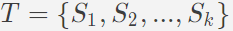

# Detección de series de tiempo multidimensionales anómalos utilizando deep learning

### Archivos

En la carpeta **tesis** se encuentra el trabajo completo y mas detallado.

En la carpeta **top_100_last** se encuentran mas ejemplos con sus mapas y respectivos valores en tablas.

En la carpeta **codigo** se encuentra el código fuente de la arquitectura del modelo de red neuronal, el modelo a sido entrenado con la librería tensorflow y keras.

Aviso: Solo se muestra el código fuente mas no los datos utilizados para el entrenamiento, ya que estos son privados.

## Resumen

Este es un resumen del proyecto de titulo que desarrolle en el ultimo año de la universidad, el objetivo de este proyecto es automatizar la detección de trayectos anómalos de vehículos basado en el historial de
rutas de la flota de vehículos usando deep learning, para ello contamos con el historial de vehículos dada por una empresa dedica al sector de la telemetría.

Uno de los principales servicios que brinda el sector de la telemetría es el monitoreo de vehículos a través de dispositivos GPS, el problema en cuanto al monitoreo de vehículos con GPS, es que estos pueden dar indicaciones erróneas si se encuentran en una zona sin cobertura digital, las cuales son almacenadas en la base de datos de la empresa.

**Tabla de contenido**

 - [Datos anómalos](#datos_anomalos)
 - [Series de tiempo](#time_series)
 - [Modelos de deep learning](#modelos)
	 - [Red autoencoder apilado](#red_autoencoder_full)
	 - [Red autoencoder convolucional](#red_autoencoder_conv)
 - [Resultados de red autoencoder convolucional](#resultados)
     - [Ejemplo 1](#ejemplo_1)
     - [Ejemplo 2](#ejemplo_2)
<h2 id="datos_anomalos">Datos anómalos</h2>
Un aspecto clave a considerar en las grandes bases de datos es que existe información errónea que se desvía de su comportamiento habitual, denominados en la literatura especializada, como datos outlier, datos atípicos o datos anómalos, para este proyecto se usara la denominación datos anómalos.  Típica mente los datos anómalos son descartados porque generan desvíos al momento de generalizar el comportamiento de un conjuntos de datos, pero también suscitan gran interés en la detección de estos datos anómalos como es el monitorio
de actividades criminales, la detección de fraudes en tarjetas de crédito, etc.

<h2 id="time_series">Series de tiempo</h2>
Dado que se desea detectar trayectos de vehículos anómalos este se puede ver como un problema de series de tiempo, por ello tomamos los trayectos de vehículos como series de tiempo.

Las series de tiempo se definen como un conjunto de observaciones tomadas en un periodo de tiempo particular ordenadas y que toman valores en diferentes momentos del tiempo, los modelos de serie de tiempo tienen un enfoque netamente predictivo. Se tiene los registros de los vehículos ordenadamente, cada registro es una observación en un tiempo $t$, entonces una serie de tiempo es una secuencia de observaciones como:

Donde es una observación multidimensional 

Un serie de tiempo es anómala donde al menos una observación es anómala.

<h2 id="modelos">Modelos de deep learning</h2>
<h3 id="red_autoencoder_full">Red autoencoder apilado </h3>

El primer modelo que se propone es una red de autoencoders apilados, esta red captura una representación de los principales patrones de los datos de entrada en un espacio de variables latentes comúnmente llamado espacio latente, para luego reconstruir la salida de la red en base al espacio latente, dado que los datos anómalos a menudo se corresponden con características no representativas, es probable que la red autoencoder apilado no pueda reconstruir los valores anómalos utilizando el espacio latente, esta reconstrucción nos permite identificar los valores anómalos como aquellos registros que no se explican bien usando el espacio latente.

<h3 id="red_autoencoder_conv">Red autoencoder convolucional</h3>
 El segundo modelo propuesto es una variante de la red autoencoder apilado, la red de autoencoders convolucionales apilados, donde el principio es el mismo que la red autoencoder apilado. Este modelo usa la operación convolucional, la cual permite extraer características de los datos de entrada a través de una matriz, lo cual nos permite
conocer los patrones locales de las características.

<h2 id="resultados">Resultados de red autoencoder convolucional</h2>
Para mostrar los resultados se mostrara 2 ejemplos de series de tiempo anómalos, se ilustrará en un mapa web y por otra lado se mostrara la tabla con sus respectivos valores.

La tabla esta compuesta por 7 variables (fecha,latitud,longitud,altitud,cog,velocidad,nsat), la columna **outlier** indica que observaciones son anómalas con un 1 y observaciones normales con un 0. La columna **error_point** es el porcentaje del error de reconstrucción de cada observación a mayor error mayor probabilidad de ser una observación anómala.

 <h3 id="ejemplo_1">Series de tiempo anómalos(Ejemplo 1)</h3>
En este ejemplo las lecturas del dispositivo GPS son errores por ello se rompe la discontinuidad de la serie de tiempo, las lecturas de latitud y longitud son lecturas erróneas.

Se observa que en la fila 32 y fila 33 en la columna latitud y longitud, se rompe la discontinuidad de las observaciones y por ello que las lecturas del GPS se disparan el mapa, observe las columna latitud y longitud de la fila 32 y 33 hay un cambio brusco, de igual forma pasa con la fila 37 y 39.

<h3 id="ejemplo_2">Series de tiempo anómalos(Ejemplo 2)</h3>
Se ilustra la serie de tiempo la cual esta compuesta por 40 observaciones , los puntos rojos son observaciones anómalas, claramente no se ve una anomalía a simple vista pero si se observa sus valores se encuentran anómalias.

Se muestra un trayecto de 40 observaciones si observamos la fila 4 y fila 5 en la columna velocidad, se ve un cambio brucos de velocidad de 136km a 0 km, coincidentemente el porcentaje de error de reconstrucción es el mas alto, de igual forma pasa con la fila 2 y fila 3 donde se ve un cambio brusco de velocidad de 24km a 112km.

